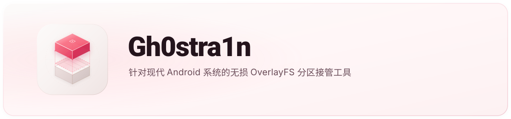

<p align="center">
  
</p>

# Gh0stra1n

针对现代Android系统的免刷入OverlayFS分区挂载与修改工具。通过Linux内核原生OverlayFS技术，在不修改底层物理只读分区的情况下实现对system、vendor、product等系统分区的无损读写修改。

## 主要功能

- 零物理覆写：使用lowerdir与upperdir双层叠加，不破坏官方系统底层，保留OTA兼容性。
- 镜像管理：支持ext4稀疏镜像创建、在线resize2fs扩容、离线极小化收缩、安全格式化与卸载。
- 闪存保护与自检：支持noatime挂载策略降低UFS闪存磨损，挂载前支持e2fsck自动修复。
- 防篡改备份恢复：利用硬件加速批量生成SHA-256校验清单，恢复前在隔离环境严格校验，拦截篡改与损坏。
- 内置工具：提供修改层文件浏览器（支持文本与图片预览）及矩形树图（Treemap）磁盘占用分析。
- 交互界面：提供动态毛玻璃底部栏、多语言支持与实时终端日志输出。

## 目录结构

- `/data/local/gh0stra1n-overlayfs/`：工作主目录
- `/data/local/gh0stra1n-overlayfs/manifest.json`：镜像状态与配置清单
- `/data/local/gh0stra1n-overlayfs/*.img`：各分区ext4镜像文件
- `/data/local/gh0stra1n-overlayfs/mnt_<part>/u/`：修改层（upperdir）
- `/sdcard/Gh0stra1n_Backup/`：备份归档目录

## 编译与安装

环境要求：JDK17+，Android SDK，Gradle。

```bash
# 编译
gradle assembleDebug

# 安装
adb install -r app/build/outputs/apk/debug/app-debug.apk
```

## 使用说明

1. 确保设备已获取Root权限（目前支持[ghostlock-PD2339FA-Neo9SPro-Root](https://github.com/LemonFan-maker/ghostlock-PD2339FA-Neo9SPro-Root)，Magisk方案，APatch，KernelSU等方案属于实验性，若出现问题，欢迎提交日志反馈）。
2. 在“分区”页面为目标分区创建ext4镜像。
3. 在“控制”页面点击“挂载OverlayFS”接管对应分区。
4. 可通过内置文件浏览器向upperdir添加或替换文件。
5. 在“设置”页面可进行一键备份或从归档防篡改恢复。

## 许可证

[Apache-2.0 License](LICENSE)
